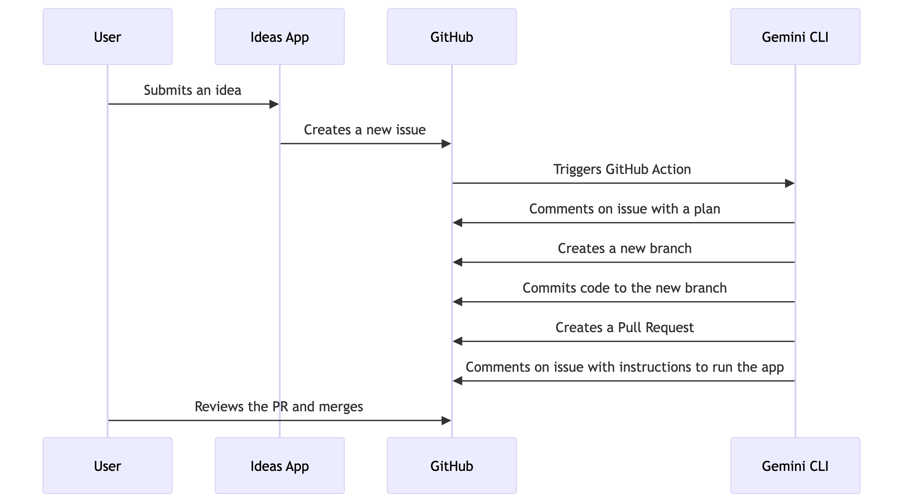

# Idea to Code: Euro Cloud Summit Demo

Welcome! This repository contains the source code for the "Idea to Code" demo application, showcased at the
Google Cloud booth during the Euro Cloud Summit in Switzerland.

This interactive demo showcases how generative AI can dramatically accelerate the software development lifecycle,
taking a simple idea from concept to a functional, deployable prototype in minutes.

## 💡 Idea Gallery

All the ideas generated during the event are available for you to explore in our interactive gallery.

* **Browse the [Idea Gallery Cloud Summit Zurich](https://palladius.github.io/booth-ideas-sg/)**
* **[Browse the Idea Gallery Singapore](https://pauldatta.github.io/booth-ideas-sg/)**

## Demo Video

Watch the complete demonstration of the "Idea to Code" workflow in action.

## Workflow

The following diagram illustrates the end-to-end process from idea submission to generating a full-fledged application.

## Accessing Your Generated Code

For visitors at the Euro Cloud Summit:

1.  When you submit your idea through our application, a new **GitHub Issue** is automatically created in this repository.
2.  Our [Gemini CLI](https://github.com/google-github-actions/run-gemini-cli) will process your idea, generate the code, and push it to a **new branch**.
3.  The [Gemini CLI](https://github.com/google-github-actions/run-gemini-cli) will then post a **comment in your GitHub Issue** containing the name of the branch and step-by-step instructions on how to clone the repository and access your code.
4.  Simply find your issue in the [Issues tab](https://github.com/pauldatta/booth-ideas-sg/issues) and follow the instructions in the comments.

## Application

The web application itself is a Next.js project located in the `ideas-app/` directory. See the [application's README](ideas-app/README.md) for instructions on how to run it locally.

## Riccardo changes

* changed `gh_pages` from branch to GH action. Now it beautifull deploys to https://palladius.github.io/booth-ideas-sg/
* Abandoned fork + added

## The code here

There are pieces of code in this repo:

* `random-app-ideas/`: collection of apps vibecoded by Gemini after users create ideas.
* `ideas-app/`: This is an app vibecoded by the original authors Paul Datta & c on Firebase Studio. can be deployed to Cloud run.
  * Ricc deployed to CR here: https://ideas-app-849075740253.europe-west1.run.app
* `gh_pages`. This is deployed to GitHub pages: https://palladius.github.io/booth-ideas-sg/
